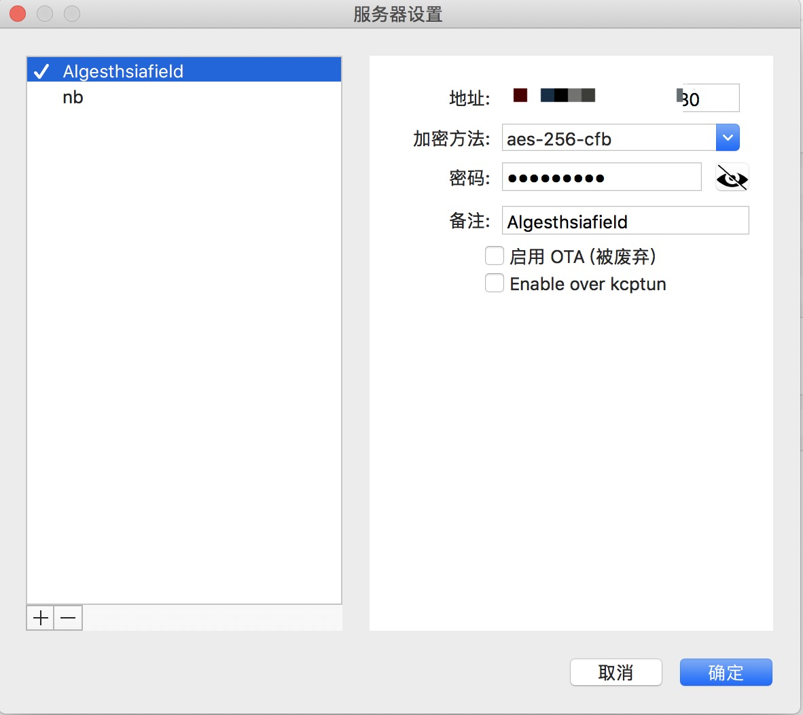

# 用shadowsocks-go搭建自己的VPN服务器

## 安装Shadowsocks服务端

直接下载shadowsocks-go
```bash
wget https://github.com/shadowsocks/shadowsocks-go/releases/download/1.2.1/shadowsocks-server.tar.gz

```
下载完成后，先解压到/opt/shadowsocks目录：
```bash
 sudo mkdir -p /opt/shadowsocks
 sudo tar -xzvf shadowsocks-server.tar.gz -C /opt/shadowsocks
```
解压后，一个文件名为shadowsocks-server的二进制文件，可以直接运行，但是需要做些配置下一步讲。

## 运行

在刚才目录下创建配置文件ss-config.json
```bash
sudo vim /opt/shadowsocks/ss-config.json
{
  "server": "0.0.0.0",
  "local_port": 1080,
  "password": "xxx",
  "method": "aes-256-cfb",
  "timeout": 600,
  "port_password": {
    "80": "xxx",
    "443": "xxx"
  }
}
```
最后运行
```bash
sudo /opt/shadowsocks/shadowsocks-server -c /opt/shadowsocks/ss-config.json
```
## 安装Shadowsocks客户端
进入官网下载
[shadowsocks](https://github.com/shadowsocks)

然后进行配置如图，其中地址是自己服务器的外部ip
